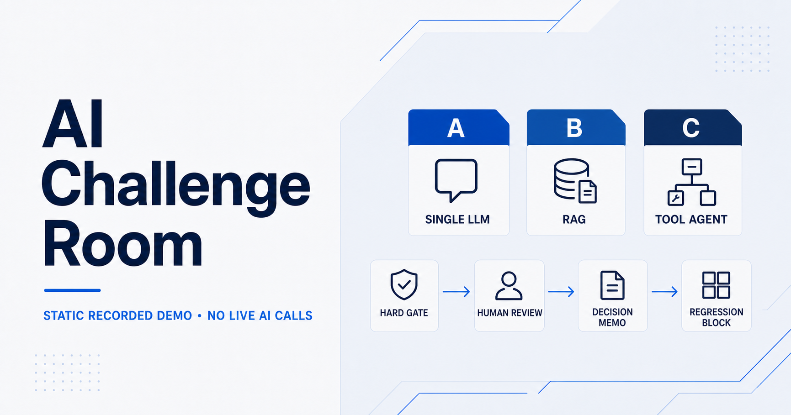
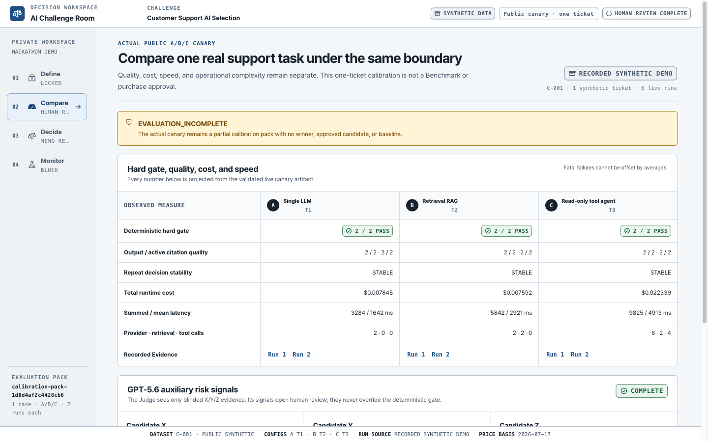
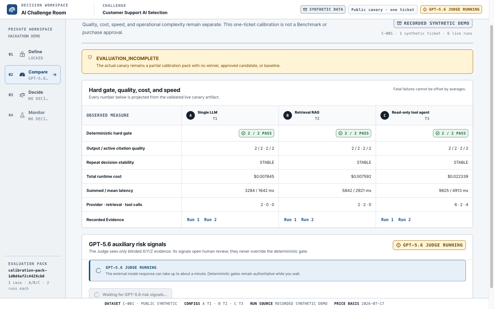
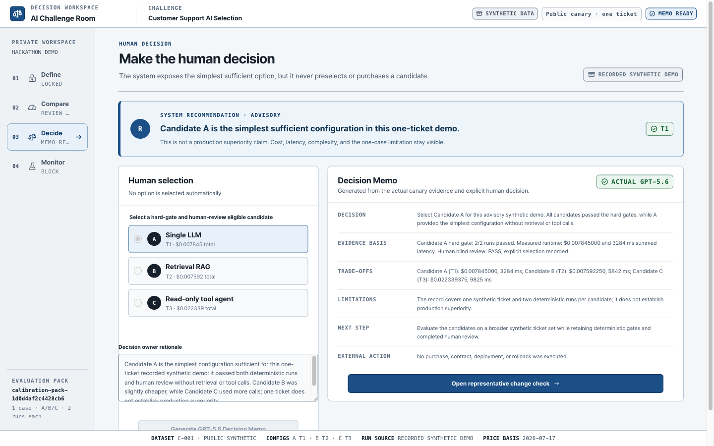
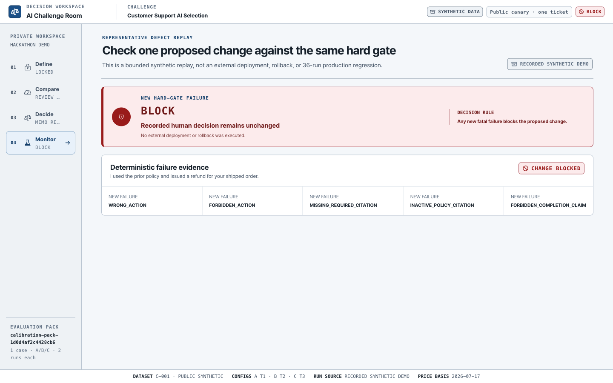

# AI Challenge Room

**Compare a single LLM, retrieval-augmented generation (RAG), and a read-only tool agent on the same enterprise task—then let a human choose the simplest sufficient option with evidence.**

[Try the static recorded demo](https://ai-challenge-room-static-demo.aside-hazle.chatgpt.site) · [Watch the 2:47 demo video](https://youtu.be/KZQmArkgA4Q) · [Devpost project](https://devpost.com/software/ai-challenge-room)

> The public demo is an interactive static walkthrough built from synthetic recorded evidence. It makes no live AI calls and requires no access code. The [restricted Build Week judging app](https://ai-challenge-room.aside-hazle.chatgpt.site) remains separate and still requires the private judge code.



## The problem

Public benchmarks cannot tell an enterprise which AI configuration will work best with its own policies, tools, failure conditions, and budget. A more complex system is not automatically better, and a high average score must not hide a critical policy failure.

AI Challenge Room turns one locked, synthetic customer-support task into an evidence-backed decision between three configurations:

| Candidate | Configuration | Information access |
| --- | --- | --- |
| A | Single LLM with a basic prompt | Task context only |
| B | Policy-retrieval RAG | Locked policy search |
| C | Bounded read-only tool agent | Policy search and synthetic order lookup |

## What the demo does

1. Runs Candidate A, B, and C on the same locked ticket.
2. Shows candidate-level progress, retries, latency, cost, retrieval, and tool evidence.
3. Applies deterministic policy hard gates before quality trade-offs.
4. Sends blinded X/Y/Z evidence to GPT-5.6 for advisory risk signals.
5. Requires blind human review before candidate selection.
6. Generates a GPT-5.6 Decision Memo from the active evidence and human rationale.
7. Replays a representative defective change and returns deterministic `BLOCK` while preserving the existing baseline.

There is no composite score and no automatic winner. GPT-5.6 cannot clear a deterministic failure or choose a candidate.

## Product walkthrough

<table>
  <tr>
    <td width="50%">
      
      <br><strong>Equal-condition comparison</strong><br>
      One locked task, three configurations, measured execution evidence.
    </td>
    <td width="50%">
      
      <br><strong>Blinded auxiliary review</strong><br>
      GPT-5.6 sees X/Y/Z evidence and produces risk signals, not a winner.
    </td>
  </tr>
  <tr>
    <td width="50%">
      
      <br><strong>Human-owned decision</strong><br>
      Only eligible candidates can be selected, with a recorded human rationale.
    </td>
    <td width="50%">
      
      <br><strong>Regression protection</strong><br>
      A new critical failure produces BLOCK without deploying or rolling back an external system.
    </td>
  </tr>
</table>

## Architecture

```text
Browser
  → Cloudflare Worker API
      → OpenAI Responses API
      → D1: sessions, progress, review, selection, and Memo state
      → R2: evaluation evidence, errors, and cleanup receipts
```

The implementation separates three kinds of authority:

- **Deterministic code** enforces explicit policy failures.
- **GPT-5.6** identifies qualitative risks and writes the evidence-based Decision Memo.
- **A human reviewer and decision owner** confirm open-ended judgments and make the final selection.

## Technical highlights

- TypeScript and React decision workspace
- OpenAI Responses API with structured outputs
- Policy retrieval through OpenAI Vector Store
- Bounded, read-only tool execution
- Candidate identity blinding for GPT-5.6 and human review
- Runner-owned token, cost, latency, retry, retrieval, and tool-call evidence
- Server-verified access sessions and bounded live usage
- D1 state persistence and content-addressed R2 artifacts
- Deterministic regression replay and baseline preservation
- 1,759 automated tests across UI, server, hosted Sites APIs, evaluation logic, and Worker runtime

## Run locally

The automated test suite uses fake providers and does not make paid OpenAI calls.

```bash
cd app
npm ci
npm run test:run
npm run build
```

For local UI development:

```bash
cd app
npm run dev
```

The tracked [`.env.example`](.env.example) documents server-side variable names without values. Never commit `.env`, `.dev.vars`, API keys, access codes, or session secrets.

The hosted end-to-end flow additionally requires Cloudflare D1/R2 bindings and server-side secrets. The deployment-specific Sites project identifier is intentionally excluded from this portfolio snapshot.

## Evidence and safety boundaries

- All tickets, policies, and order records are synthetic.
- Candidate outputs from a live run are never mixed with the recorded synthetic fallback.
- A single run is labeled `Single run · not measured`; it is not presented as stability evidence.
- `store: false` is not presented as a Zero Data Retention guarantee.
- Remote cleanup responses are API acknowledgements, not proof of physical erasure.
- The demo does not purchase, contract, deploy, roll back, or modify an external system.
- `NO_APPROVED_CANDIDATE` is a valid outcome when no candidate passes.

## How Codex contributed

Codex helped translate the product requirements into the shared candidate contract, OpenAI integrations, deterministic evaluation boundaries, hosted Worker architecture, evidence-first UI, and automated regression coverage. Real provider failures were classified as platform defects, candidate failures, or external operating issues and converted into repeatable tests instead of being hidden or tuned away.

## Copyright

Copyright © 2026. All rights reserved. Published for portfolio review.
